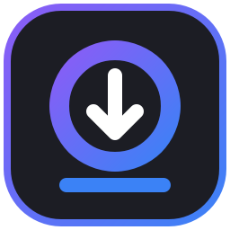
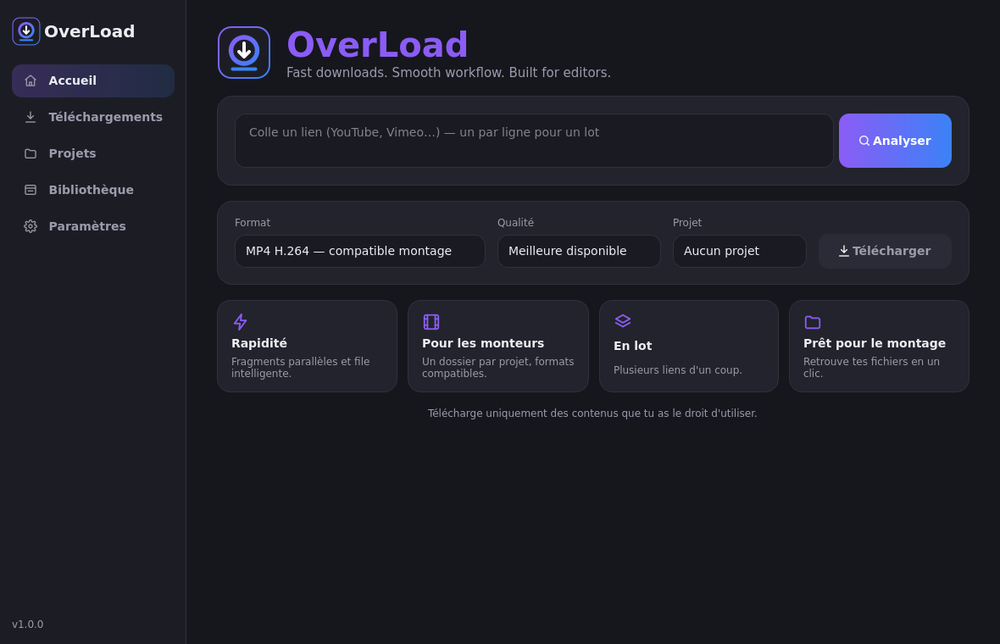
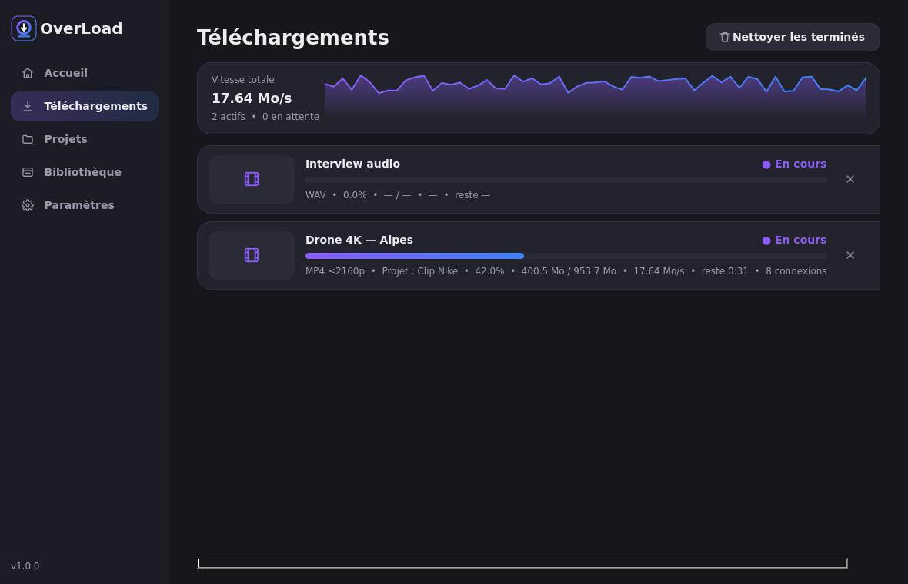
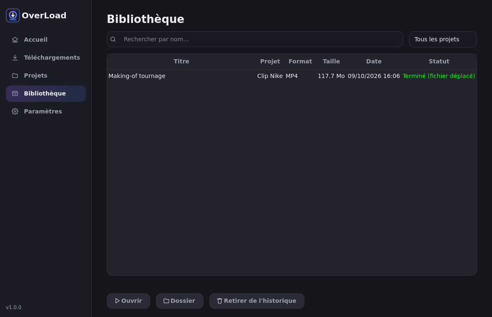

<p align="center">
  
</p>

<h1 align="center">OverLoad</h1>
<p align="center"><b>Fast downloads. Smooth workflow. Built for editors.</b></p>

<p align="center">
  <a href="https://github.com/TOFazer/OverLoad/releases/latest"></a>
  <a href="https://github.com/TOFazer/OverLoad/actions/workflows/ci.yml"></a>
  
  
</p>

OverLoad est une application Windows qui sert à préparer, lancer et organiser les téléchargements de vidéos
(YouTube, Vimeo et [plus de 1 000 sources](https://github.com/yt-dlp/yt-dlp/blob/master/supportedsites.md))
pour le montage, sans garder dix onglets ouverts dans le navigateur.



## ✨ Fonctionnalités

| | |
|---|---|
| ⚡ **Rapidité** | Fragments parallèles (connexions **adaptées à la taille du fichier**), plusieurs téléchargements en même temps, vitesse réelle en Mo/s et graphique en direct |
| 🎬 **Pour les monteurs** | Un **dossier par projet**, classement par projet ou par source, MP4 H.264 compatible avec Premiere Pro, DaVinci Resolve et Final Cut, WAV sans perte |
| 📚 **En lot** | Colle plusieurs liens d'un coup (un par ligne) : ils partent tous dans la file |
| 📂 **Prêt pour le montage** | Bibliothèque consultable par recherche : résolution, images/s, codecs, taille ; ouvrir le fichier ou son dossier |
| 🔁 **Fiable** | Reprise des téléchargements interrompus (même après une fermeture de l'app), nouvelles tentatives automatiques, vérification d'intégrité et empreinte SHA-256 |
| 🛡️ **Sûr** | Liens filtrés (http/https publics uniquement), noms de fichiers assainis, mises à jour vérifiées via les Releases GitHub officielles |
| 🎨 **Agréable** | Thème sombre ou clair, français ou anglais, notifications, aucune publicité |

<p>
  
  
</p>

## 📥 Installation

1. Ouvre la [dernière release](https://github.com/TOFazer/OverLoad/releases/latest).
2. Télécharge **`OverLoad-Setup-x.y.z.exe`**. Une version portable `.zip` est aussi disponible.
3. *(Recommandé)* Vérifie l'empreinte du fichier avec `SHA256SUMS.txt` :
   ```powershell
   Get-FileHash .\OverLoad-Setup-1.0.0.exe -Algorithm SHA256
   ```
4. Lance l'installateur ; tu peux choisir de créer un raccourci sur le bureau.

> Tant que l'exe n'est pas signé numériquement, Windows SmartScreen peut afficher un avertissement :
> clique sur **Informations complémentaires**, puis sur **Exécuter quand même**.

Tes paramètres, ton historique et ta file d'attente sont enregistrés dans `%APPDATA%\OverLoad`. Ils sont **conservés lors des mises à jour**.

## ⚡ À propos de la vitesse

OverLoad utilise le moteur [yt-dlp](https://github.com/yt-dlp/yt-dlp) et cherche à **tirer le meilleur parti de ta connexion**
(connexions parallèles quand la source les autorise, file intelligente, reprise). En revanche, **aucune application ne
peut garantir une vitesse supérieure sur toutes les plateformes** : le serveur, ta connexion et les limites imposées par la source
comptent autant que le logiciel.

Pour mesurer toi-même la vitesse obtenue (médiane sur plusieurs essais, par nombre de connexions) :

```bash
python scripts/benchmark.py "https://lien-de-test" --connections 1 4 8 --runs 3
```

Le script produit un rapport Markdown et un fichier CSV : **seules des mesures réelles sont publiées**.

## 🛠️ Développement

```bash
git clone https://github.com/TOFazer/OverLoad && cd OverLoad
python -m venv .venv && .venv\Scripts\activate
pip install -r requirements-dev.txt
python main.py          # lancer l'app
python -m pytest        # 34 tests (dont de vrais téléchargements en local)
build.bat               # exe + installateur (Inno Setup requis pour l'installateur)
```

```
OverLoad/
├── main.py                  # point d'entrée
├── version.py
├── ui/                      # interface PySide6
│   ├── main_window.py       # barre latérale + navigation
│   ├── home_page.py         # coller / analyser / télécharger
│   ├── downloads_page.py    # file, progression, graphique de vitesse
│   ├── projects_page.py     # Mode Monteur
│   ├── history_page.py      # bibliothèque
│   ├── settings_page.py
│   ├── speed_graph.py, theme.py, common.py
├── core/
│   ├── url_analyzer.py      # validation, qualités, tailles, infos techniques
│   ├── download_manager.py  # moteur yt-dlp, connexions adaptatives, intégrité
│   └── queue_manager.py     # simultanés, doublons, reprise
├── services/                # paramètres, historique, i18n, mises à jour
├── assets/                  # logo et icônes
├── installer/               # Inno Setup
├── scripts/benchmark.py
└── tests/
```

**Publier une version :** modifie `version.py` et `CHANGELOG.md`, puis
`git tag v1.0.0 && git push --tags`. GitHub Actions teste, construit l'installateur et la version portable,
calcule les empreintes SHA-256 et publie la release.

## ⚖️ Usage responsable

Télécharge uniquement des contenus dont tu détiens les droits, qui sont sous licence libre, ou pour lesquels tu as
l'autorisation de l'auteur. Respecte les conditions d'utilisation de chaque plateforme.

## 🤝 Contribuer

Les retours et contributions sont les bienvenus : voir [CONTRIBUTING.md](CONTRIBUTING.md) et la [roadmap](ROADMAP.md).
Tu as trouvé un bug ? Ouvre une [issue](https://github.com/TOFazer/OverLoad/issues).

## Licence

[MIT](LICENSE). OverLoad s'appuie sur [yt-dlp](https://github.com/yt-dlp/yt-dlp) (Unlicense), [PySide6](https://doc.qt.io/qtforpython/) (LGPL) et [FFmpeg](https://ffmpeg.org) (LGPL/GPL, via imageio-ffmpeg).
